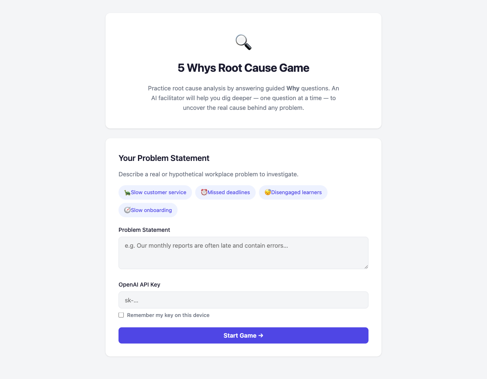

# 5 Whys Root Cause Game

An interactive web-based learning game for adult learners to practice the **5 Whys** root cause analysis technique with AI-guided facilitation.



## Live Demo

[**Play the Game**](https://alfredang.github.io/5whys/)

## What is the 5 Whys?

The 5 Whys is a problem-solving technique where you repeatedly ask "Why?" to drill down from a surface-level problem to its root cause. It's widely used in Lean, Six Sigma, and continuous improvement methodologies.

## How It Works

1. **Enter a problem statement** — describe a real or hypothetical workplace issue
2. **Answer 5 Why questions** — an AI facilitator asks contextual questions based on your answers
3. **Review your analysis** — get a structured summary with the likely root cause, a corrective action, and a reflection prompt

## Features

- AI-powered facilitation using the OpenAI API
- One question at a time with animated progress tracking
- Example problems to get started quickly
- Structured summary with root cause and corrective action
- Copy to clipboard and print/PDF export
- Confetti celebration on completion
- Responsive design for desktop and mobile
- Single HTML file — no build step, no dependencies

## Getting Started

### Option 1: Use the live demo
Visit [alfredang.github.io/5whys](https://alfredang.github.io/5whys/) and bring your own OpenAI API key.

### Option 2: Run locally
```bash
git clone https://github.com/alfredang/5whys.git
cd 5whys
open index.html
```

## Requirements

- A modern web browser
- An [OpenAI API key](https://platform.openai.com/api-keys)

## Tech Stack

- HTML / CSS / Vanilla JavaScript
- OpenAI Chat Completions API (`gpt-4o-mini`)

## License

MIT
